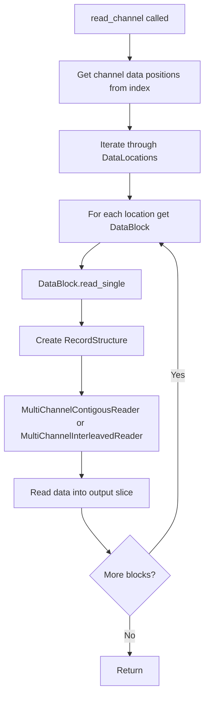
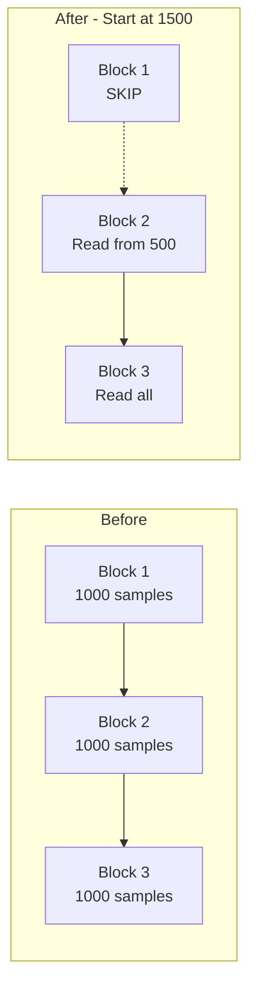

# Issue #23: Start Position for Read API

## Problem Statement

The current read API supports limiting the length of the read with the length of the provided slice to read into. However, it does not allow starting at an arbitrary point in the channel data.

**Current API:**
```rust
pub fn read_channel<D: TdmsStorageType>(
    &mut self,
    channel: &ChannelPath,
    output: &mut [D],
) -> Result<(), TdmsError>
```

**Desired Behavior:**
- Allow specifying a start position (number of samples to skip)
- The reader should skip that many samples before starting to read
- Performance optimization: skip entire data blocks that don't need to be read

## Architecture Analysis

### Current Data Flow



### Key Data Structures

1. **DataLocation** - [`src/index/mod.rs:22`](src/index/mod.rs:22)
   - `data_block: usize` - Index of the data block
   - `channel_index: usize` - Channel index within the block
   - `number_of_samples: u64` - Number of samples in this location

2. **DataBlock** - [`src/raw_data/mod.rs:99`](src/raw_data/mod.rs:99)
   - `start: u64` - File position where block starts
   - `length: NonZeroU64` - Block length in bytes
   - `layout: DataLayout` - Interleaved or Contiguous
   - `channels: Vec<RawDataMeta>` - Channel metadata
   - `byte_order: Endianess` - Big or Little endian

3. **RecordStructure** - [`src/raw_data/records.rs:42`](src/raw_data/records.rs:42)
   - Encodes the structure of the block for reading
   - Contains read instructions for each channel

## Proposed Solution

### API Design Options

#### Option A: New Method with Start Parameter
```rust
pub fn read_channel_from<D: TdmsStorageType>(
    &mut self,
    channel: &ChannelPath,
    start: u64,
    output: &mut [D],
) -> Result<(), TdmsError>
```

**Pros:**
- Backward compatible - existing `read_channel` unchanged
- Clear intent in method name
- Simple to understand

**Cons:**
- API surface grows
- Duplication of logic

#### Option B: Builder Pattern / Options Struct
```rust
pub struct ReadOptions {
    pub start: u64,
}

impl Default for ReadOptions {
    fn default() -> Self {
        Self { start: 0 }
    }
}

pub fn read_channel_with_options<D: TdmsStorageType>(
    &mut self,
    channel: &ChannelPath,
    output: &mut [D],
    options: ReadOptions,
) -> Result<(), TdmsError>
```

**Pros:**
- Extensible for future options
- Backward compatible

**Cons:**
- More complex API
- Overkill for single option

#### Option C: Modify Existing Method (Breaking Change)
```rust
pub fn read_channel<D: TdmsStorageType>(
    &mut self,
    channel: &ChannelPath,
    start: u64,
    output: &mut [D],
) -> Result<(), TdmsError>
```

**Pros:**
- Single method to maintain
- Clean API

**Cons:**
- Breaking change for existing users

### Recommended Approach: Option A

Add a new method `read_channel_from` that accepts a start position. The existing `read_channel` can be implemented as a wrapper calling `read_channel_from(channel, 0, output)`.

## Implementation Plan

### Phase 1: Core Implementation

#### 1.1 Add `read_channel_from` method to [`TdmsFile`](src/file/channel_reader.rs:39)

```rust
/// Read a single channel from the tdms file starting at a specific sample position.
///
/// channel should provide a path to the channel.
/// start is the number of samples to skip before reading.
/// output is a mutable slice for the data to be written into.
///
/// If there is more data in the file than the size of the slice, we will stop reading at the end of the slice.
pub fn read_channel_from<D: TdmsStorageType>(
    &mut self,
    channel: &ChannelPath,
    start: u64,
    output: &mut [D],
) -> Result<(), TdmsError>
```

#### 1.2 Implement Block-Level Skipping

The key optimization is to skip entire data blocks when the start position is beyond them:

```rust
// Pseudocode for block-level skipping
let mut samples_to_skip = start;
let mut samples_read = 0;

for location in data_positions {
    // Skip entire blocks if possible
    if samples_to_skip >= location.number_of_samples {
        samples_to_skip -= location.number_of_samples;
        continue;
    }
    
    // Partial skip within block
    let block_start_offset = samples_to_skip;
    samples_to_skip = 0;
    
    // Read from this block with offset
    let block = self.index.get_data_block(location.data_block)?;
    samples_read += block.read_single_from(
        location.channel_index,
        block_start_offset,
        &mut self.file,
        &mut output[samples_read..],
    )?;
    
    if samples_read >= output.len() {
        break;
    }
}
```

#### 1.3 Add `read_single_from` to [`DataBlock`](src/raw_data/mod.rs:108)

```rust
/// Read a single channel from the block starting at a specific sample offset.
pub fn read_single_from<D: TdmsStorageType>(
    &self,
    channel_index: usize,
    start_sample: u64,
    reader: &mut (impl Read + Seek),
    output: &mut [D],
) -> Result<usize, TdmsError>
```

### Phase 2: Reader Modifications

#### 2.1 Contiguous Reader Changes

For contiguous data, skipping is efficient because samples are stored sequentially per channel:

```
Block Layout (Contiguous):
[Ch1 Sample 0][Ch1 Sample 1]...[Ch1 Sample N][Ch2 Sample 0][Ch2 Sample 1]...
```

To skip samples in contiguous layout:
1. Calculate byte offset: `skip_bytes = start_sample * element_size`
2. Seek to: `channel_start + skip_bytes`
3. Read remaining samples

#### 2.2 Interleaved Reader Changes

For interleaved data, samples are stored row by row:

```
Block Layout (Interleaved):
[Ch1 S0][Ch2 S0][Ch3 S0][Ch1 S1][Ch2 S1][Ch3 S1]...
```

To skip samples in interleaved layout:
1. Calculate row offset: `skip_rows = start_sample`
2. Calculate byte offset: `skip_bytes = skip_rows * row_size`
3. Seek to: `block_start + skip_bytes`
4. Read remaining rows

### Phase 3: RecordStructure Modifications

The [`RecordStructure`](src/raw_data/records.rs:42) needs to support:
1. A start offset for the read operation
2. Adjusted sample counts based on the offset

```rust
pub fn build_record_plan_with_offset(
    channels: &[RawDataMeta],
    outputs: &'b mut [(usize, &'b mut [T])],
    start_offset: u64,
) -> Result<RecordStructure<'o, T>, TdmsError>
```

## Performance Considerations

### Block-Level Skipping

The most significant optimization is skipping entire data blocks:



### Seek vs Read Trade-off

For small skip amounts within a block, it may be faster to read and discard than to seek. This is a potential future optimization but not required for initial implementation.

## Testing Strategy

### Unit Tests

1. **Basic functionality tests:**
   - Read from start position 0 (same as current behavior)
   - Read from middle of single block
   - Read from middle spanning multiple blocks
   - Read with start position beyond available data

2. **Edge cases:**
   - Start position exactly at block boundary
   - Start position at last sample
   - Empty output slice
   - Start position larger than channel length

3. **Data layout tests:**
   - Contiguous single channel
   - Contiguous multi-channel
   - Interleaved single channel
   - Interleaved multi-channel

### Integration Tests

1. Read partial data from real TDMS files
2. Verify data integrity when reading with offset
3. Compare results with full read + slice

### Benchmark Tests

1. Compare performance of:
   - Full read + slice vs read_channel_from
   - Different start positions (beginning, middle, end)
   - Different block sizes

## Future Considerations

### Multi-Channel API

The issue mentions starting with single channel and expanding to multi-channel if it makes sense. For multi-channel reads with different start positions per channel, the complexity increases significantly because:

1. Different channels may have different block alignments
2. The read plan becomes more complex
3. Performance optimization is harder

**Recommendation:** Implement single-channel first, evaluate usage patterns, then consider multi-channel if needed.

### Range-Based Reading

A natural extension would be to support reading a range:
```rust
pub fn read_channel_range<D: TdmsStorageType>(
    &mut self,
    channel: &ChannelPath,
    start: u64,
    length: u64,
    output: &mut [D],
) -> Result<(), TdmsError>
```

This is already implicitly supported by the output slice length, but an explicit API might be clearer.

## Implementation Checklist

- [ ] Add `read_channel_from` method to `TdmsFile`
- [ ] Implement block-level skipping in channel reader
- [ ] Add `read_single_from` to `DataBlock`
- [ ] Modify `MultiChannelContigousReader` to support start offset
- [ ] Modify `MultiChannelInterleavedReader` to support start offset
- [ ] Update `RecordStructure` if needed
- [ ] Add unit tests for new functionality
- [ ] Add integration tests
- [ ] Add benchmark tests
- [ ] Update documentation and examples
- [ ] Consider deprecation strategy for old API (if any)
