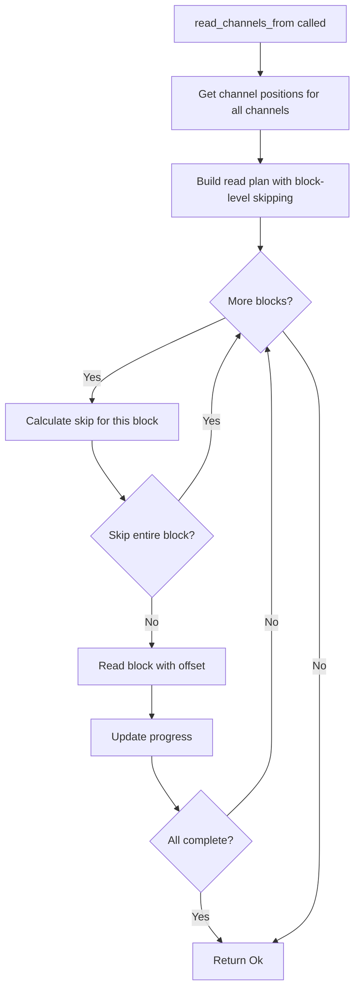

# Multi-Channel Start Position Read API Design

## Overview

This document outlines the design for extending the start position read API to support reading multiple channels with individual start offsets. This builds upon the existing [`read_channel_from()`](../src/file/channel_reader.rs:72) implementation for single channels.

## Current State

### Single-Channel API (Implemented)

```rust
pub fn read_channel_from<D: TdmsStorageType>(
    &mut self,
    channel: &ChannelPath,
    start: u64,
    output: &mut [D],
) -> Result<(), TdmsError>
```

This method:
- Skips entire data blocks when `start >= block.number_of_samples`
- Uses offset-aware reading within blocks via [`read_single_from()`](../src/raw_data/mod.rs:251)
- Works for both contiguous and interleaved layouts

### Multi-Channel API (No Start Position)

```rust
pub fn read_channels<D: TdmsStorageType>(
    &mut self,
    channels: &[impl AsRef<ChannelPath>],
    output: &mut [&mut [D]],
) -> Result<(), TdmsError>
```

This method:
- Uses a read plan to visit data blocks in order
- Tracks progress per channel via [`ChannelProgress`](../src/file/channel_reader.rs:16)
- Reads all channels from each block in a single pass

## Design Challenges

### Challenge 1: Different Start Positions Per Channel

When channels have different start positions, they may need to:
- Skip different numbers of blocks
- Start reading at different offsets within the same block
- Have different amounts of data remaining in each block

**Example:**
```
Block 0: [Ch1: 1000 samples][Ch2: 1000 samples]
Block 1: [Ch1: 1000 samples][Ch2: 1000 samples]

read_channels_from(
    channels: [Ch1, Ch2],
    starts: [500, 1500],  // Ch1 starts at 500, Ch2 starts at 1500
    outputs: [buf1, buf2]
)

Ch1: Skip 500 in Block 0, read 500 from Block 0, read all of Block 1
Ch2: Skip Block 0 entirely, skip 500 in Block 1, read 500 from Block 1
```

### Challenge 2: Data Layout Implications

**Contiguous Layout:**
```
[Ch1 S0][Ch1 S1]...[Ch1 SN][Ch2 S0][Ch2 S1]...[Ch2 SN]
```
- Each channel's data is stored sequentially
- Can seek independently within each channel's section
- Different start offsets are straightforward - just seek to different positions

**Interleaved Layout:**
```
[Ch1 S0][Ch2 S0][Ch1 S1][Ch2 S1]...[Ch1 SN][Ch2 SN]
```
- Data is stored row by row
- All channels share the same row structure
- **Problem:** Cannot efficiently skip different amounts per channel
- Must read entire rows and selectively discard samples

### Challenge 3: Block-Level Optimization

The current single-channel implementation skips entire blocks when possible. For multi-channel:
- A block can only be skipped if ALL channels have start positions beyond that block
- Partial block reads become more complex with different offsets

## Proposed API Options

### Option A: Uniform Start Position

The simplest approach - all channels share the same start position:

```rust
pub fn read_channels_from<D: TdmsStorageType>(
    &mut self,
    channels: &[impl AsRef<ChannelPath>],
    start: u64,
    output: &mut [&mut [D]],
) -> Result<(), TdmsError>
```

**Pros:**
- Simple API
- Efficient for both layouts
- Block-level skipping works naturally
- Covers the most common use case (time-aligned data)

**Cons:**
- Cannot handle channels with different start positions

### Option B: Per-Channel Start Positions

Each channel has its own start position:

```rust
pub fn read_channels_from<D: TdmsStorageType>(
    &mut self,
    channels: &[impl AsRef<ChannelPath>],
    starts: &[u64],
    output: &mut [&mut [D]],
) -> Result<(), TdmsError>
```

**Pros:**
- Maximum flexibility
- Handles all use cases

**Cons:**
- Complex implementation for interleaved data
- May require reading and discarding data
- Block-level optimization becomes complex

### Option C: Builder Pattern

A more flexible approach using a builder:

```rust
pub struct MultiChannelRead<'a, D> {
    channels: Vec<ChannelReadConfig<'a, D>>,
}

pub struct ChannelReadConfig<'a, D> {
    path: &'a ChannelPath,
    start: u64,
    output: &'a mut [D],
}

impl<F: Read + Seek> TdmsFile<F> {
    pub fn read_channels_builder<D: TdmsStorageType>(&mut self) -> MultiChannelReadBuilder<D> {
        MultiChannelReadBuilder::new()
    }
}
```

**Pros:**
- Very flexible
- Can add more options later
- Clear per-channel configuration

**Cons:**
- More complex API
- May be overkill for simple cases

## Recommended Approach: Option A (Uniform Start)

Given the complexity of handling different start positions per channel, especially for interleaved data, I recommend starting with **Option A: Uniform Start Position**.

### Rationale

1. **Common Use Case:** Most TDMS files contain time-aligned data where all channels share the same time base. Reading from a specific time point means the same sample offset for all channels.

2. **Efficient Implementation:** A uniform start position allows:
   - Block-level skipping when all channels can skip
   - Simple offset calculation within blocks
   - Efficient handling of both contiguous and interleaved layouts

3. **Incremental Complexity:** Users who need per-channel offsets can:
   - Make multiple single-channel calls
   - Use the existing [`read_channel_from()`](../src/file/channel_reader.rs:72) method

4. **Future Extension:** Option A can be extended to Option B later if needed, without breaking the API.

## Implementation Plan

### Phase 1: Uniform Start Position API



### Implementation Steps

1. **Add `read_channels_from()` method to [`TdmsFile`](../src/file/channel_reader.rs:39)**
   - Accept uniform `start: u64` parameter
   - Modify read plan to account for start offset

2. **Modify [`read_plan()`](../src/file/channel_reader.rs:222) function**
   - Add start offset parameter
   - Skip blocks where all channels have been fully skipped
   - Track remaining skip per channel

3. **Extend [`ChannelProgress`](../src/file/channel_reader.rs:16) struct**
   - Add `samples_to_skip: u64` field
   - Track skip progress separately from read progress

4. **Modify [`get_block_read_data()`](../src/file/channel_reader.rs:172) function**
   - Account for per-block skip amounts
   - Adjust output slice offsets

5. **Update [`DataBlock::read()`](../src/raw_data/mod.rs:190) or add `read_from()`**
   - The `read_from()` method already exists but is private
   - Make it public or add a multi-channel variant

6. **Add comprehensive tests**
   - Test with contiguous layout
   - Test with interleaved layout
   - Test block-level skipping
   - Test partial block reads
   - Test edge cases (start beyond data, etc.)

### Code Changes Summary

| File | Changes |
|------|---------|
| [`src/file/channel_reader.rs`](../src/file/channel_reader.rs) | Add `read_channels_from()`, modify `read_plan()`, extend `ChannelProgress` |
| [`src/raw_data/mod.rs`](../src/raw_data/mod.rs) | Expose `read_from()` or add multi-channel variant |
| [`tests/read_with_offset.rs`](../tests/read_with_offset.rs) | Add multi-channel offset tests |

## Future Considerations

### Phase 2: Per-Channel Start Positions (Optional)

If per-channel start positions are needed:

1. **For Contiguous Layout:** Relatively straightforward - each channel can seek independently

2. **For Interleaved Layout:** Two approaches:
   - **Read and Discard:** Read all rows, discard samples before each channel's start
   - **Multiple Passes:** Make separate passes for channels with different start positions

### Alternative: Streaming API

For very large files, consider a streaming API:

```rust
pub fn channel_stream_from<D: TdmsStorageType>(
    &mut self,
    channel: &ChannelPath,
    start: u64,
) -> impl Iterator<Item = Result<D, TdmsError>>
```

This would allow processing data without loading it all into memory.

## Summary

The recommended approach is to implement a **uniform start position API** for multi-channel reads. This covers the most common use case efficiently while keeping the implementation manageable. Per-channel start positions can be added later if needed.

### API Signature

```rust
/// Read multiple channels from the tdms file starting at a specific sample position.
///
/// All channels will start reading from the same sample offset.
/// This is efficient for time-aligned data where all channels share the same time base.
pub fn read_channels_from<D: TdmsStorageType>(
    &mut self,
    channels: &[impl AsRef<ChannelPath>],
    start: u64,
    output: &mut [&mut [D]],
) -> Result<(), TdmsError>
```
